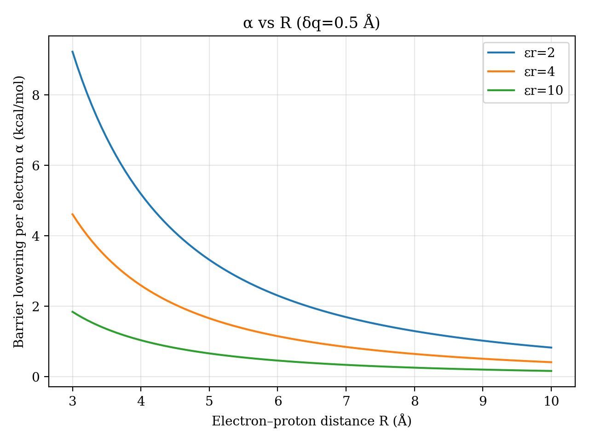
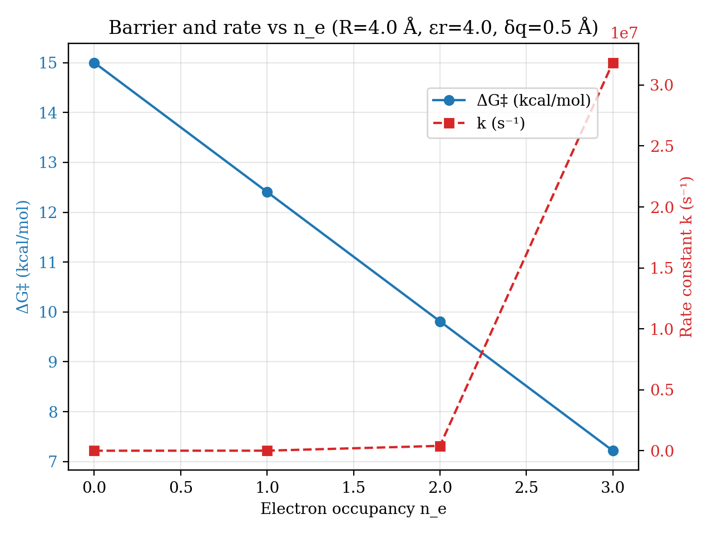
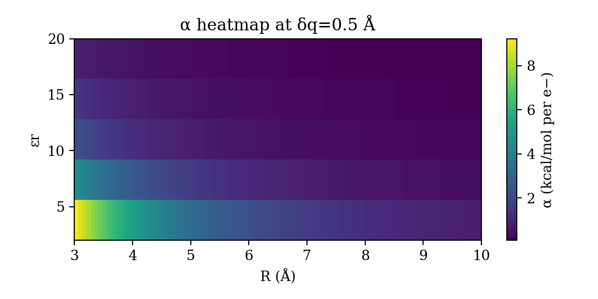
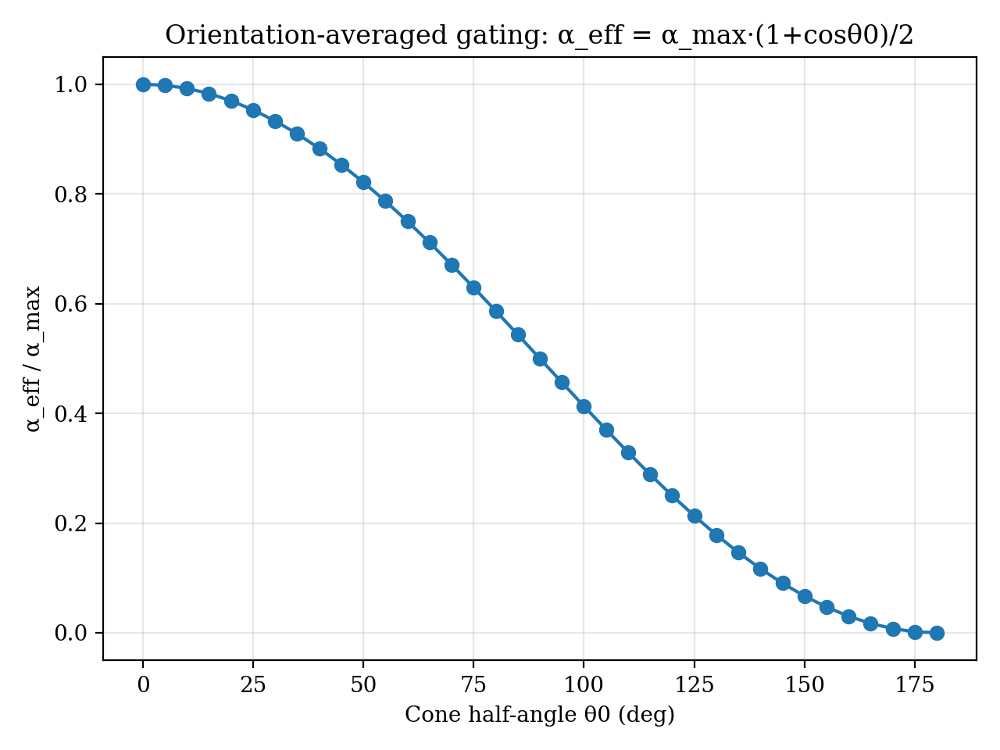
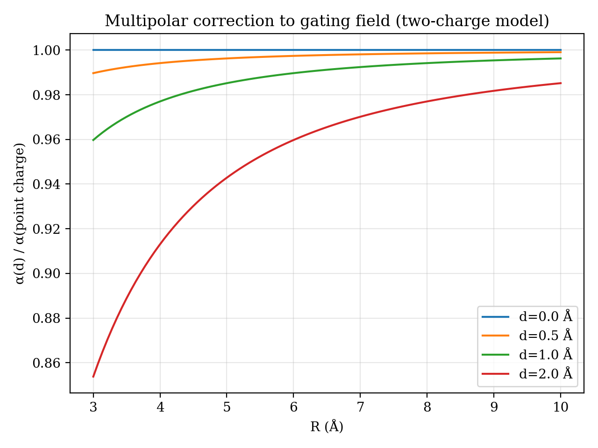
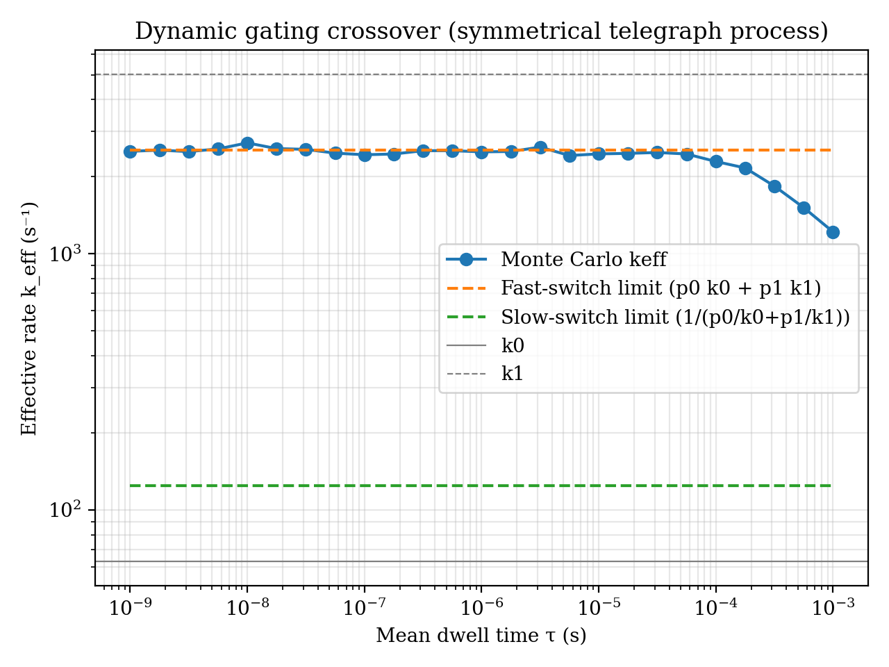

# Code for: Electron-Gated Proton Transfer: A Closed-Form Electrostatic Design Rule with an External Benchmark

[](https://opensource.org/licenses/MIT)
[](https://www.python.org/downloads/)
<!-- When you have a DOI, uncomment this line and replace the placeholder -->
<!-- [](https://doi.org/10.5281/zenodo.XXXXXXX) -->

This repository contains the code to reproduce all figures and data presented in our manuscript, *"Electron-Gated Proton Transfer: A Closed-Form Electrostatic Design Rule with an External Benchmark"*.

---

## Abstract

Local electric fields in enzymes and molecular catalysts modulate reaction barriers, yet a compact rule that links transient electron occupancy to proton-transfer kinetics has been lacking. We derive an explicit, closed-form coefficient for barrier lowering, α = 332.063·δq/(εr·R2) kcal·mol−1 per electron, obtained from Coulombic work projected along the proton coordinate, where R is the electron–proton distance (Å), εr is the local dielectric, and δq is the transition-state displacement (Å). EGPT reframes electron occupancy as a tunable kinetic gate that leaves overall thermochemistry unchanged and provides falsifiable, actionable design rules for accelerating proton transfer in enzymes, molecular catalysts, and photo- and electrocatalytic systems.

---

## Generated Figures

Running the main script will generate all figures from the paper. Here are some key examples:

| Figure 1 | Figure 2 |
| :---: | :---: |
|  |  |

| Figure 3 | Figure 4 |
| :---: | :---: |
|  |  |

| Figure 5 | Figure 6 |
| :---: | :---: |
|  |  |

---

## Setup and Usage

### Prerequisites

This project requires Python 3.8 or newer.

### Installation

1.  **Clone the repository:**
    ```bash
    git clone <https://github.com/G0wOz1PV/NEQO>
    cd <NEQO>
    ```

2.  **(Recommended) Create and activate a virtual environment:**
    ```bash
    # For Unix/macOS
    python3 -m venv venv
    source venv/bin/activate

    # For Windows
    python -m venv venv
    .\venv\Scripts\activate
    ```

3.  **Install dependencies:**
    All required packages are listed in `requirements.txt`. Install them with pip:
    ```bash
    pip install -r requirements.txt
    ```
    *Note: If `requirements.txt` is not provided, you can typically install the necessary libraries manually (e.g., `pip install numpy pandas matplotlib`).*

### Execution

To generate all figures and associated CSV data files, simply run the main script from the project's root directory:

```bash
python simulation.py
```

This command will:
1.  Create two directories if they don't exist: `csv/` and `png/`.
2.  Run all simulations and calculations.
3.  Save raw data as `.csv` files in the `csv/` directory.
4.  Save all figures as `.png` files in the `png/` directory.

---

## Repository Structure

```
.
├── egpc_simulation.py    # Main Python script to run simulations and generate figures
├── requirements.txt      # List of Python dependencies
├── csv/                  # Directory for generated CSV data (created by script)
├── png/                  # Directory for generated figures (created by script)
├── LICENSE               # Project license file
├── validation
└── README.md             # This file
```


---

## License

This project is licensed under the MIT License.
